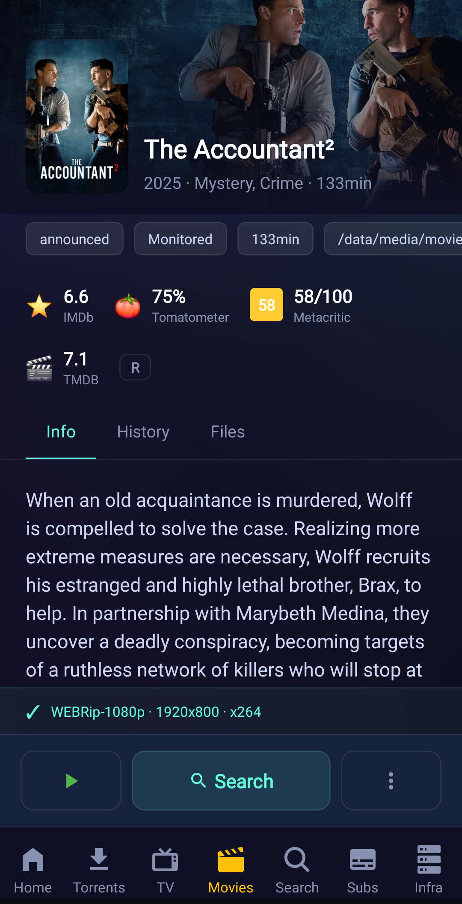
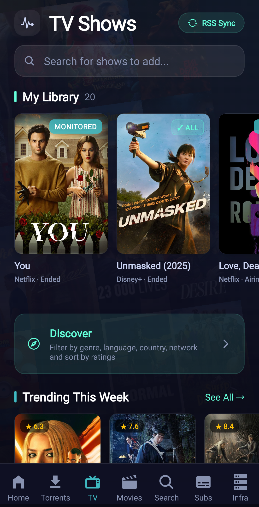
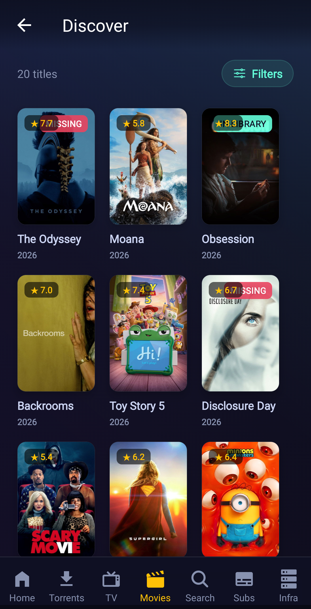
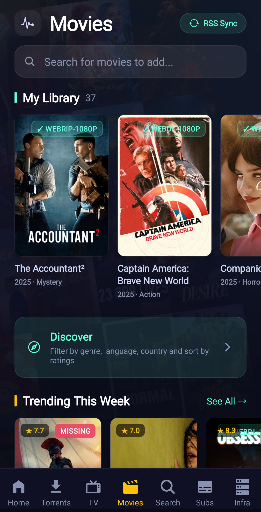
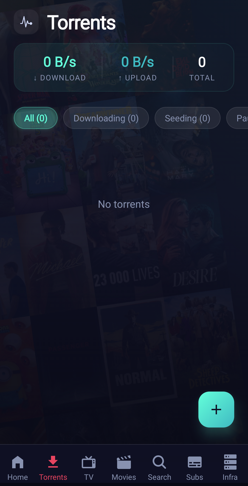
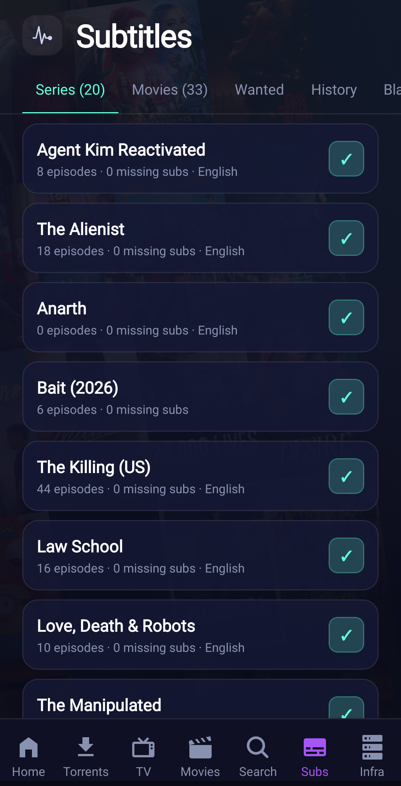
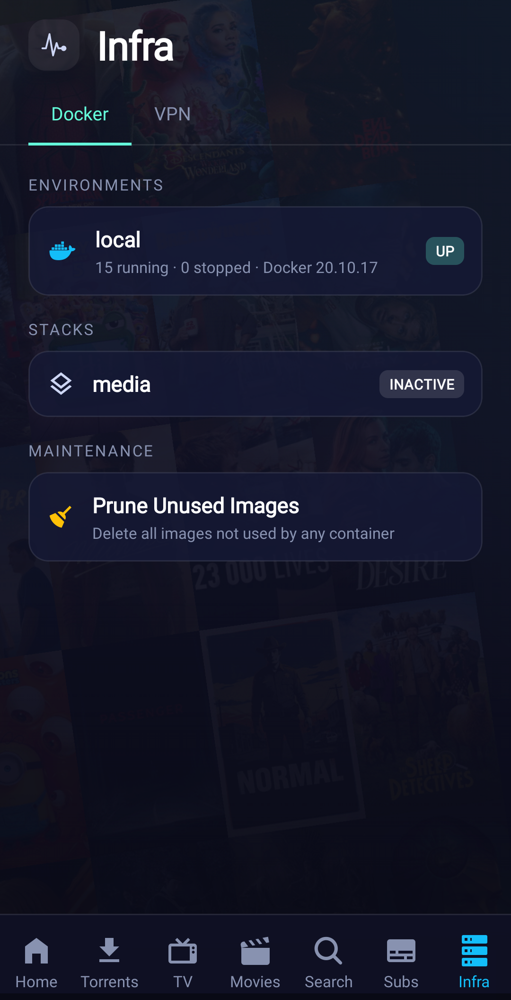

<div align="center">


# OpenArr

**Your whole self-hosted media stack in one Android app**

Sonarr · Radarr · Bazarr · Prowlarr · Transmission · Portainer · Gluetun · Emby

[](https://github.com/gdsoumya/openarr/actions/workflows/ci.yml)
[](https://github.com/gdsoumya/openarr/actions/workflows/release.yml)
[](https://github.com/gdsoumya/openarr/releases/latest)
[](LICENSE)
[](https://github.com/gdsoumya/openarr/releases/latest)
[](https://expo.dev)

   

</div>

Manage libraries, discover what to watch next, grab releases, fix subtitles,
watch your downloads fly, and keep the containers and VPN underneath it all
healthy, from one fast, polished app. No accounts, no telemetry, no backend:
the app talks directly to your own services. Free and open source, MIT
licensed.

## Features

- **Home**: cross-service dashboard: continue watching and next-up from Emby,
  latest unwatched shows/movies (cross-referenced against your Emby watched
  state), a scrollable schedule of upcoming monitored releases, and a
  cumulative health pill for every connected service.
- **TV & Movies**: full Sonarr/Radarr library management plus
  Jellyseerr-style discovery: trending/popular/genre rows, personalized
  "because you added X" recommendations, advanced filters (genre, language,
  country, network, year range, runtime, per-source rating minimums) and sorts
  by TMDB/IMDB/Rotten Tomatoes ratings.
- **Interactive search**: Sonarr/Radarr-grade manual release search with
  quality/custom-format/seeder details, plus Prowlarr indexer search.
- **Torrents**: Transmission client: live speeds, filters, add via magnet,
  per-torrent files and controls.
- **Subs**: full Bazarr management: search/download per episode or movie,
  wanted, history, blacklist, providers, mass search.
- **Infra**: Portainer (stacks, containers, logs, lifecycle, image prune) and
  Gluetun VPN (status, exit IP, start/stop, change location).
- **Multi-server**: several server profiles with separate local/remote URLs,
  automatic or manual local/remote switching, encrypted on-device storage,
  backup/restore.

## Supported services

| Service | Auth | Default port | Notes |
|---|---|---|---|
| Sonarr | API key | 8989 | Settings → General → API Key |
| Radarr | API key | 7878 | Settings → General → API Key |
| Prowlarr | API key | 9696 | Settings → General → API Key |
| Bazarr | API key | 6767 | Header auth (`X-API-KEY`) |
| Transmission | Basic auth | 9091 | `/rpc` appended automatically |
| Portainer | Access token | 9000 | See gotchas below |
| Gluetun | none | 8000 | **Requires the custom fork (see below)** |
| Emby | API key | 8096 | Settings → Advanced → API Keys |

Discovery uses TMDB (bundled read token, overridable in Settings) and OMDB for
IMDB/Rotten Tomatoes ratings (bring your own free key from
[omdbapi.com](https://www.omdbapi.com/apikey.aspx) for rating filters/sorts).

## Configuration gotchas

- **URLs**: enter the base URL as you'd open it in a browser, including any
  path prefix your reverse proxy uses (e.g. `http://nas:8080/sonarr`). Each
  service takes an optional separate remote URL; the app picks local/remote
  automatically (any Wi-Fi = local) or manually via Settings → Connection →
  Auto/Local/Remote, use the override when you're on Wi-Fi away from home.
- **Portainer**: React Native cannot skip self-signed certificate validation,
  so Portainer's default self-signed HTTPS (`:9443`) will not work. Use the
  HTTP port (default `:9000`, enable it under Portainer settings if needed) or
  put Portainer behind a reverse proxy with a valid certificate. Create the
  token under My account → Access tokens.
- **Gluetun**: stock gluetun has no web UI and its control API alone isn't
  enough for the in-app experience. OpenArr targets a **custom gluetun build**
  with a bundled web UI and the control API served alongside it:
  [github.com/gdsoumya/gluetun](https://github.com/gdsoumya/gluetun), published
  as dated image tags at `ghcr.io/gdsoumya/gluetun`. Point OpenArr at the
  control server port (default `8000`); the app auto-detects whether the API
  lives at `/v1` (current builds) or `/api/v1` (older builds).
- **Emby**: an admin-created API key is used; watched state comes from the
  server's first user, which fits single-user setups. "Open in Emby" deep-links
  into the Emby app when installed, otherwise the web UI.
- **HTTP vs HTTPS**: cleartext HTTP is supported for LAN use, but anything
  remote should be HTTPS, the app warns when a remote URL uses `http://`
  because API keys and passwords would travel unencrypted.
- **Backups**: Settings → Data exports all server configs as JSON. The export
  contains keys/passwords in plaintext, store it somewhere safe.

## More screenshots

<div align="center">
   
</div>

## Installing

Grab the APK from the [latest release](https://github.com/gdsoumya/openarr/releases)
and sideload it, or build from source below.

## Building

Requirements: Node 20+, JDK 17, Android SDK (`ANDROID_HOME`), a device or
emulator.

```bash
npm install
make android-install   # release APK, installed to the connected device
make android           # debug build
make test && make typecheck
```

Release builds are signed with `android/keystore.properties` (not committed);
see `make help` for all targets. iOS is untested.

## Contributing

See [CONTRIBUTING.md](CONTRIBUTING.md), and `CLAUDE.md` for the architecture
and the performance/security rules the codebase follows.

## License

[MIT](LICENSE) © Soumya Ghosh Dastidar
